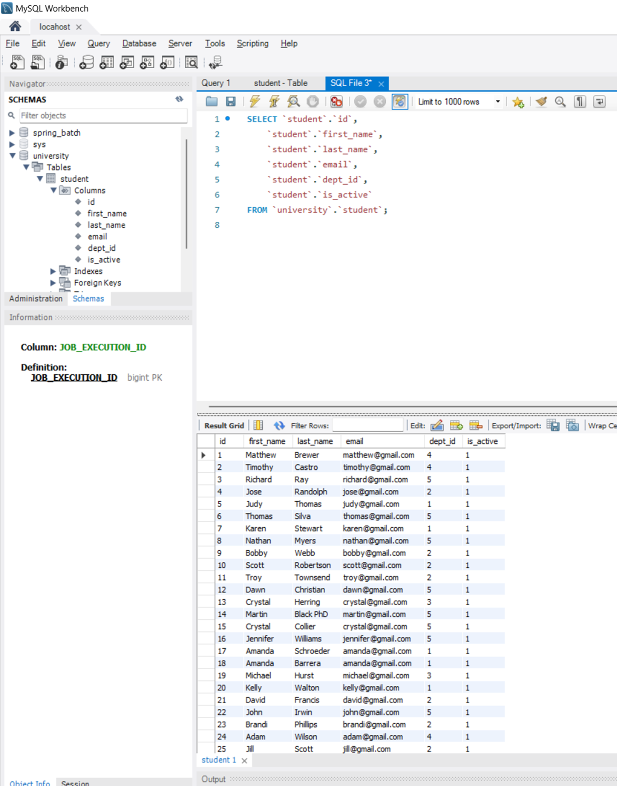

# spring-batch-postgresql-to-mysql-data-migration

Data Migration From PostgreSql to Mongo DB Using jpaCursorItemReader and jpaItemWriter.

## PostgreSQL Input Data

## MySQL Output Data

## Spring Batch Transaction Management Table
